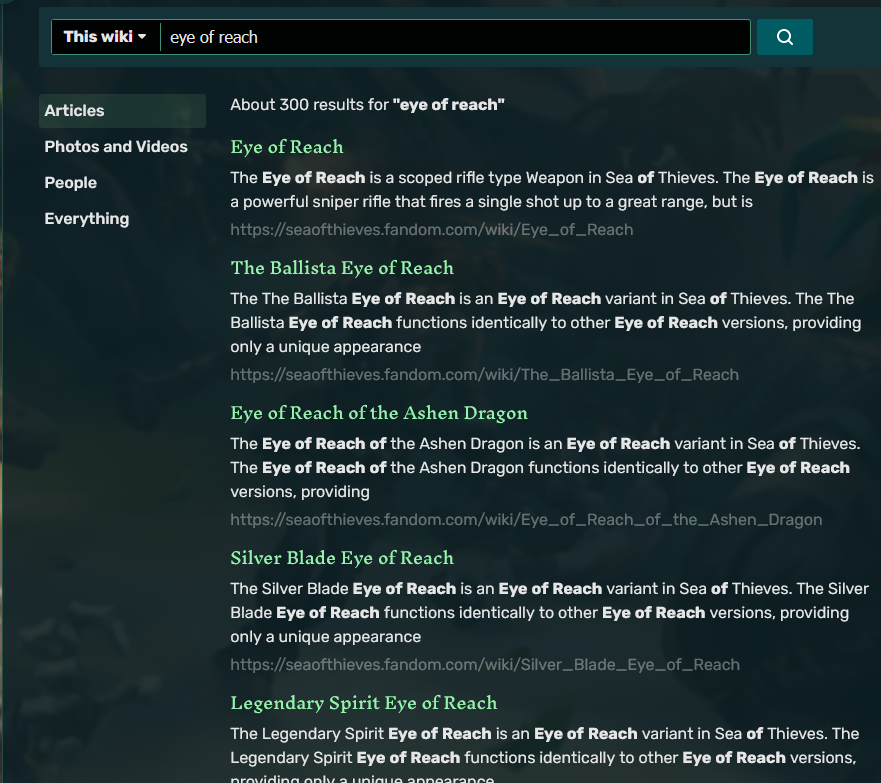
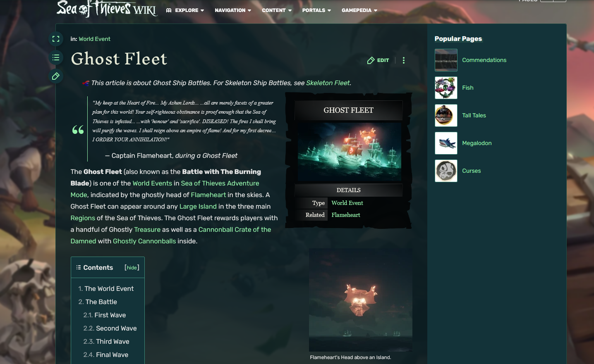
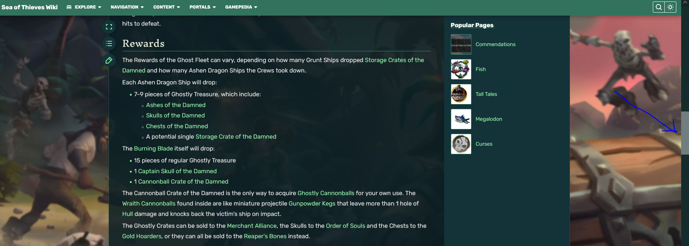
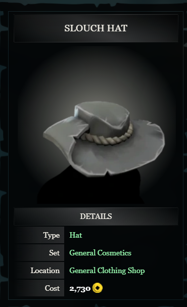

# Sea of Thieves Companion

## Introduction

We want to create a companion discord bot for the game "Sea of Thieves" which would allow the user to query the SOT (Sea of Thieves for short) [wiki](https://seaofthieves.fandom.com/wiki/Sea_of_Thieves_Wiki) for information on items, factions, missions, prizes, resources, etc.. The bot would then process that query and output it's findings in a discord channel for everyone in the group to see. Sea of Thieves is Gaming.

## Initial Situation
Right now Sea of Thieves is a game in which very few things get explained to the player. Users have to figure everything out by themselves. This can be challgenging at times, which is why the SOT Community collects it's knowledge in a game wiki. The wiki helps a lot, but there are a few flaws to the way the information is presented and accessed. For starters the users have to start their browser mid-game, causing a big lag spike and takes away from the immersion. Additionally the integrated search feature is not really efficient as it dumps a bunch of search results on the user, even though the first one usually is what the user is looking for. Furthermore the wikipages themselves contain a lot of useless and unnecessary information, further adding to the confusing and complicated user experience. Another problem is that it is tedious to share the information one user has researched with their fellow crewmates, the user would have to copy the link from the address bar, send it to a common discord channel and the recipients would also have to open the link on their end, again causing a huge lag spike.

As shown in the above example, the first article is what the user is looking for. And the others are just cosmetic items and give no relevant, quick information about the weapon itself.

### Example: 
This is what the user gets if they enter the search term "Ghost Fleet" in a quest to find out which loot the ghost fleet drops.

For the relevant information the user would have to scroll through half the article.

## Problem
In Sea of Thieves it is crucial to be the fastest and smartest in combat. But sometimes players lack just one small piece of information, possibly causing the crew to lose the battle and their ship with, all their treasures aboard, to be sunk. For obvious reasons you can't just google whatever information is needed, because in the time the player opens their browser the ship might have already been sunk.

## By using a discord bot a lot of these flaws could be eliminated
Users mostly play in groups and commmunicate via Discord. If users could research in this app they would not have to open a browser, avoiding all the performance issues. On the contrary a discord bot could handle quick researches very fast and eliminate all the time inefficiencies by providing the user with the first search result in the wiki and trimming away all the unnecessary information. 
Additionally because the bot outputs it's findings to a discord channel others in the group can easily view the information as well.
  

## General Conditions and Constraints

Using the bot has to be simpler and faster than the established procedure.
The output has to be printed in a way the user can get the information faster than googling it.

## Project Objectives and System Concepts

* A user can query the wiki by inputting a command in a discord channel.
* The output is easily readable and formatted intuitively.
* The user can then by reacting to the output get further details.
  

## Opportunities and Risks

### Opportunities:
Looking something up will not break the user's immersion.
Using the bot will be much simpler and faster than the established procedure and it could become an established feature for the community that everyone uses.
### Risks:
If the bot really takes off and we have the bot running on a small server, it likely will not be able to keep up with the amount of queries entered. Lots of downtime could cost a lot of users.
## Planning
### Milestones:
| Milestone                                                                    	| Status      	| Finish Date 	|
|------------------------------------------------------------------------------	|-------------	|-------------	|
| The project environment is set up and fully functional for all team members  	| Not Started 	|6.1.2022      	|
| The bot is running                                                           	| Not Started 	|10.2.2022     	|
| The bot can process querys and output basic description for searched article 	| Not Started 	|             	|
| The bot sends the image of an infotable                                      	| Not Started 	|             	|
| The users get further information by reacting to the bots message            	| Not Started 	|             	|
| The bot can dynamically integrate pictures into its messages                 	| Not Started 	|             	|

### Is there a Start Date?
January 2022
### Is there a End Date?
July 2022
### When does implementation work start?
It starts when we are done setting up our working environment.